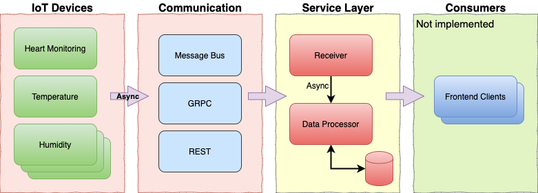

# IoT Demo

This is a personal project inspired by a code assignment a friend has to do while applying to a new job.

I found out the requirements very interesting and decided to do my own implementation and even add some more requirements.

## Description
IoT devices send out continuous data which we want to collect (e.g thermostat, heart rate meter,
car fuel readings, etc).

The task is to build a pipeline via which we can process the IoT data in a scalable manner.

In addition to that, a secure web service for querying the readings (e.g average/median/max/min values)
of specific sensors or groups of sensors for a specific timeframe.

This project is not a production ready system but should close as it can be.

**Requirements**
- Simulate data for at least 3 IoT devices which send out a value every second
- Scalable and extendable to work with more IoT devices
- Fast
- Self-contained

## Solution Architecture

[]


## How To Setup

```
docker run -d -p 5000:5000 --name registry registry:2

docker build . -f Dockerfile-device -t localhost:5000/iot-device
docker push localhost:5000/iot-device

docker build . -f Dockerfile-main -t localhost:5000/iot-main
docker push localhost:5000/iot-main

```